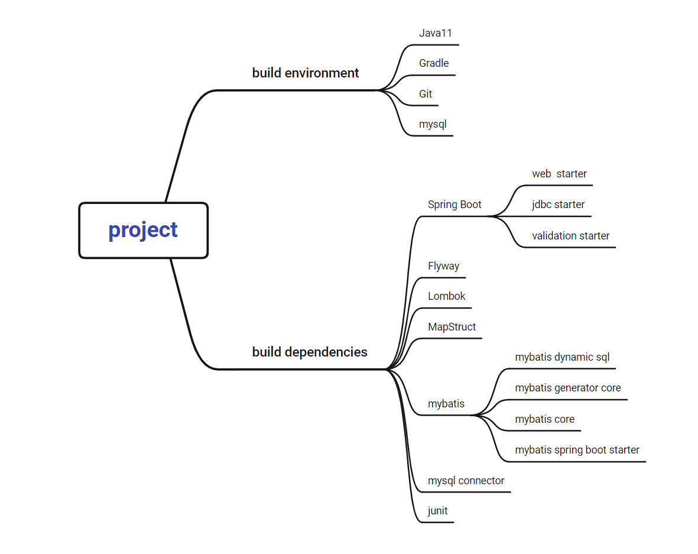
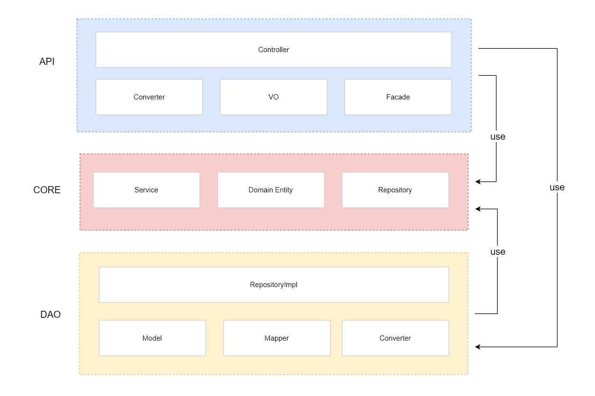

# mybatis-dynamic-sql-integration-demo

## Description

A sample code integration mybatis generator, mybatis dynamic sql, spring-boot.

**integration features**

- Generate Entity from database by run Gradle Task `dao:mybatisGenerate`
- Auto migration database DDL or DML by flyway
- Integration Lombok and MapStruct to simplify the code
- Integration Mybatis-Dynamic-SQL and shows how write complicated DSL SQL


# Build



# Run

1. First: modify `api/resources/application.yml`

```yaml
spring:
  datasource:
    driver-class-name: com.mysql.cj.jdbc.Driver
    url: jdbc:mysql://{your database url}/{your database name}
    username: { your database username }
    password: { your database password } 
```

2. Second: modify `dao/resources/generatorConfiguration.xml`

```xml

<generatorConfiguration>

    <context id="dsql" targetRuntime="MyBatis3DynamicSql">
        <!-- ...... -->
        <jdbcConnection driverClass="com.mysql.cj.jdbc.Driver"
                        connectionURL="jdbc:mysql://{your database url}/{your database name}"
                        userId="{your database username}"
                        password="{your database password}"/>
        <!-- ...... -->
    </context>
</generatorConfiguration>
```

3. Run Main class `api/java/cc/cc1234/api/Application.java`


# Module




## API

| Method | EndPoint                               | Request Body                          | Description                   |
| ------ | -------------------------------------- | ------------------------------------- | ----------------------------- |
| POST   | /v1/api/user                           | {"username":"hello", "gender":"MALE"} | create user                   |
| DELETE | /v1/api/users/{userId}                 | N/A                                   | delete user                   |
| PATCH  | /v1/api/users/{userId}                 | {"username":"hello", "gender":"MALE"} | update user basic information |
| GET    | /v1/api/users?page=1&size=20           | N/A                                   | list users                    |
| GET    | /v1/api/users/{userId}/goods/purchased | N/A                                   | query user purchased goods    |
